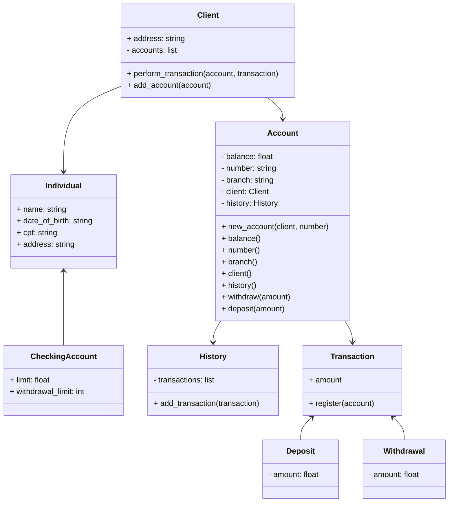

### Bank Management System

This Python program implements a simple bank management system with classes representing clients, accounts, transactions, and transaction history.

### Usage

To use this system, you can follow the diagram below:

### Classes

1. **Client**: Represents a client with an address and accounts.
2. **IndividualClient**: Represents a physical person, inherits from Client.
3. **Account**: Represents a bank account with a balance, number, agency, client, and transaction history.
4. **CheckingAccount**: Represents a checking account, inherits from Account, with additional attributes like withdrawal limit and transaction limit.
5. **History**: Represents the transaction history associated with an account.
6. **Transaction**: Abstract base class for transactions.
7. **Withdrawal**: Represents a withdrawal transaction.
8. **Deposit**: Represents a deposit transaction.

### Contributing

Feel free to contribute to this project by forking it and submitting pull requests with your enhancements or bug fixes.

### License

This project is licensed under the MIT License - see the [LICENSE](LICENSE) file for details.
